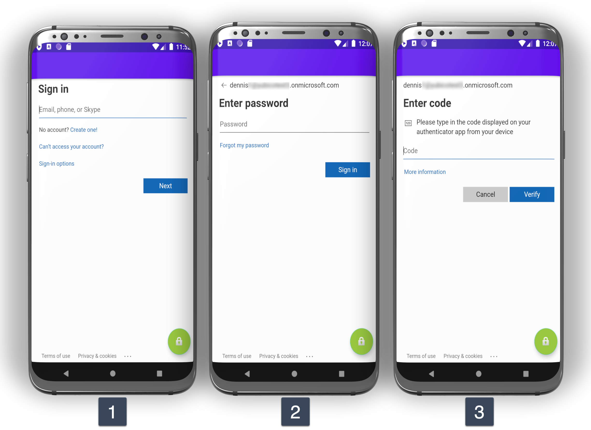

# Android-AzureAD-MFA
Description: 
Android (Kotlin) client application using WebView/MSAL/ADAL to authenticate a user to Azure Active Directory with MFA. 

## Goal
Overall goal: An Android app that can securely authenticate a user to Azure Active Directory using WebAuthn.

Create a native Android client to non-interactively authenticate a user to Azure Active Directory with MFA. Since the Android WebView does not support FIDO2, the initial phase is to enable TOTP as the MFA for the users but have this client automate the retrieval of the 6-digit OTP code from a YubiKey and paste it into the OTP field during authentication to Azure Active Directory using this login: https://myprofile.microsoft.com

## Considerations
1. Use the built-in [WebView](https://developer.android.com/reference/android/webkit/WebView) from android.webkit.WebView Class and automate the input for username + password + OTP or just automate the retrieval of the OTP from YubiKey OATH and paste the 6-digit code into the field as shown in screen #3 below.

2. Using the [Microsoft Authentication Library (MSAL)](https://github.com/Azure-Samples/ms-identity-android-kotlin) for Android. The MSAL Android library gives your app the ability to begin using the Microsoft identity platform by supporting Azure Active Directory and Microsoft Accounts in a converged experience using industry standard OAuth2 and OpenID Connect protocols. Contrary to ADAL (below), MSAL proposes a clean separation between public client applications, and confidential client applications.

3. Use the [Active Directory Authentication Library (ADAL)](https://github.com/AzureAD/azure-activedirectory-library-for-android) for Android. The ADAL SDK gives your application the full functionality of Microsoft Azure AD, including industry standard protocol support for OAuth2, Web API integration with user level consent, and two-factor authentication support. ADAL proposes the notion of AuthenticationContext, which is a connection to Azure AD.

4. Use [AppAuth for Android](https://github.com/openid/AppAuth-Android) AppAuth is a client SDK for communicating with OAuth 2.0 and OpenID Connect providers using Chrome Custom Tabs for authorization requests.

## Azure Active Directory Authentication flow
There is no API for authentication so the users are reuqired to navigate the web interface. The current flow looks like this:

